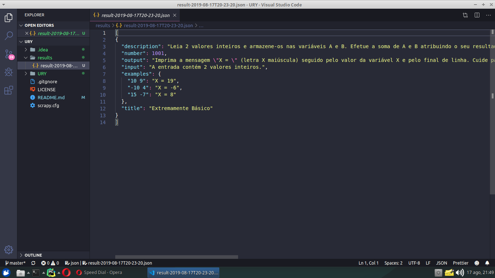

# URY


URI Online Judge scrapy

## Screenshot


## Setup
Install dependencies.
```shell script
$ pip3 install scrapy
```

## Examples
Mining default (from 1001 to 1005)
```shell script
$ scrapy crawl problems
```

Mining from 1007
```shell script
$ scrapy crawl problems -a stop=1007 
```

Mining from 1005 to 1010
```shell script
$ scrapy crawl problems -a start=1005 stop=1010 
```

## License
>You can check out the full license [here](https://github.com/oDallas/URY/blob/master/LICENSE)

This project is licensed under the terms of the **MIT** license.